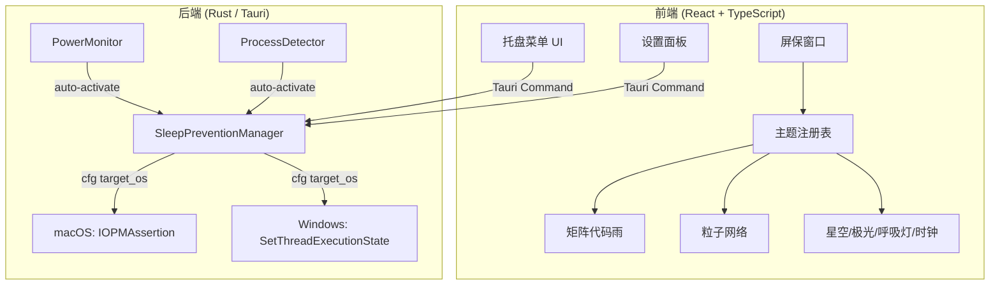

## 产品概述

AntiSleep 是一款跨平台防锁屏工具，专为 AI 开发无人值守场景设计。应用以系统托盘/菜单栏常驻形态运行，同时提供可展开的屏保可视化窗口，兼具实用性与趣味性。支持 macOS 和 Windows 双平台。

## 核心功能

- **防锁屏引擎**：跨平台阻止系统自动锁屏/休眠，macOS 使用 IOKit API，Windows 使用 Win32 API，支持防屏幕休眠、防系统休眠两种模式
- **系统托盘控制**：常驻系统托盘图标，一键启停防锁屏，显示当前状态与倒计时
- **屏保可视化窗口**：全屏可展开窗口，展示动态动画效果，兼具防锁屏与视觉美化作用
- **多主题系统**：科技风（矩阵代码雨、粒子网络）、自然风（星空、极光）、简约风（呼吸灯、时钟）等多种可切换主题
- **个性化设置**：自定义防锁屏时长、自动启停规则、主题偏好、透明度等参数
- **智能场景**：检测到充电状态/特定进程运行时自动激活防锁屏

## 技术栈

- **框架**：Tauri 2.0（Rust 后端 + Web 前端）
- **前端**：React + TypeScript + Tailwind CSS + Vite
- **后端**：Rust（Tauri 核心）
- **屏保渲染**：HTML Canvas / WebGL
- **数据持久化**：Tauri Store 插件（JSON 文件）
- **构建工具**：Vite + pnpm

## 实现方案

### 跨平台防锁屏机制

通过 Rust 条件编译（`#[cfg]`）实现平台适配：

- **macOS**：通过 `core-foundation` / `core-graphics` crate 调用 IOKit 的 `IOPMAssertionCreateWithName`，创建电源断言阻止休眠
- **Windows**：通过 `windows-rs` crate 调用 Win32 API `SetThreadExecutionState`，设置 `ES_CONTINUOUS | ES_SYSTEM_REQUIRED | ES_DISPLAY_REQUIRED` 阻止休眠
- 两个平台均通过 Tauri Command 暴露统一的 `start_prevention` / `stop_prevention` 接口给前端

### 系统托盘架构

使用 Tauri 2.0 内置的 Tray 功能（`tauri::tray`），跨平台统一：

- 托盘图标动态切换（活跃/暂停/错误）
- 右键/点击菜单快捷操作
- 点击可展开屏保窗口

### 屏保窗口架构

- 独立 Tauri Window 作为屏保展示窗口，全屏无边框，透明背景
- 前端使用 `requestAnimationFrame` + Canvas 绘制高性能动画
- 每个主题是一个独立的渲染类，遵循统一接口协议
- 支持窗口透明度调节，不影响后台观察

### 主题系统

- 定义 `ThemeRenderer` 接口协议（`init` / `render` / `resize` / `destroy`）
- 每个主题实现自己的 Canvas 渲染逻辑
- 主题通过注册表管理，支持后续扩展
- 主题配置（颜色、速度、密度）可通过设置面板自定义

### 参考项目

工作区内的 `mark-magic` 项目使用相同的 Tauri 2.0 技术栈（`tauri 2`、`@tauri-apps/api ^2.10.1`、`@tauri-apps/cli ^2.10.1`、Vite + React + TypeScript），其项目结构、Cargo.toml 配置、tauri.conf.json 配置模式可直接复用。

## 架构设计



## 目录结构

```
/Users/yorke/Desktop/cloud5/AntiSleep/
├── docs/
│   └── PRODUCT_DESIGN.md              # [NEW] 产品设计文档
├── src/                                # 前端源码
│   ├── main.tsx                        # [NEW] React 入口
│   ├── App.tsx                         # [NEW] 应用根组件
│   ├── styles/
│   │   └── globals.css                 # [NEW] Tailwind 全局样式
│   ├── components/
│   │   ├── TrayMenu.tsx                # [NEW] 托盘菜单面板组件
│   │   ├── ScreensaverWindow.tsx       # [NEW] 屏保全屏窗口组件
│   │   ├── SettingsPanel.tsx           # [NEW] 设置面板组件
│   │   └── FloatingControls.tsx        # [NEW] 屏保悬浮控制条
│   ├── themes/
│   │   ├── types.ts                    # [NEW] ThemeRenderer 接口定义
│   │   ├── registry.ts                 # [NEW] 主题注册表
│   │   ├── matrix.ts                   # [NEW] 科技风-矩阵代码雨
│   │   ├── particle-network.ts         # [NEW] 科技风-粒子网络
│   │   ├── starfield.ts                # [NEW] 自然风-星空
│   │   ├── aurora.ts                   # [NEW] 自然风-极光
│   │   ├── breathing-light.ts          # [NEW] 简约风-呼吸灯
│   │   └── clock.ts                    # [NEW] 简约风-时钟
│   ├── hooks/
│   │   ├── useSleepPrevention.ts       # [NEW] 防锁屏状态管理 Hook
│   │   └── useSettings.ts             # [NEW] 设置状态管理 Hook
│   └── lib/
│       └── tauri-commands.ts           # [NEW] Tauri Command 封装
├── src-tauri/                          # Rust 后端源码
│   ├── Cargo.toml                      # [NEW] Rust 依赖配置
│   ├── build.rs                        # [NEW] Tauri 构建脚本
│   ├── tauri.conf.json                 # [NEW] Tauri 应用配置
│   ├── icons/                          # [NEW] 应用图标
│   └── src/
│       ├── main.rs                     # [NEW] Tauri 入口，注册插件与命令
│       ├── commands.rs                 # [NEW] Tauri Command 定义
│       ├── sleep_prevention.rs         # [NEW] 防锁屏核心逻辑（跨平台分发）
│       ├── platform/
│       │   ├── mod.rs                  # [NEW] 平台模块入口
│       │   ├── macos.rs                # [NEW] macOS IOKit 实现
│       │   └── windows.rs              # [NEW] Windows SetThreadExecutionState 实现
│       └── power_monitor.rs            # [NEW] 电源状态监听
├── index.html                          # [NEW] HTML 入口
├── package.json                        # [NEW] Node.js 依赖配置
├── tsconfig.json                       # [NEW] TypeScript 配置
├── vite.config.ts                      # [NEW] Vite 构建配置
├── tailwind.config.js                  # [NEW] Tailwind 配置
└── README.md                           # [NEW] 项目说明
```

## 实现备注

- Tauri 2.0 的 Tray API 需要在 `tauri.conf.json` 中声明 `tray` 权限，在 `capabilities` 中配置
- macOS 的 IOKit 调用需要添加 `core-foundation` 和 `core-graphics` crate 依赖；Windows 需要 `windows-sys` crate
- Rust 条件编译使用 `#[cfg(target_os = "macos")]` 和 `#[cfg(target_os = "windows")]` 切换平台实现
- 防锁屏断言生命周期必须严格管理，应用退出时必须释放，否则系统无法正常休眠——利用 Tauri 的 `on_window_event` 监听 CloseRequested 事件做清理
- Canvas 动画使用 `requestAnimationFrame` 驱动，当屏保窗口不可见时应暂停渲染以节省 CPU
- 参考 mark-magic 项目的 Tauri 2.0 配置模式（tauri.conf.json 结构、Cargo.toml 依赖版本、前端 @tauri-apps/api 调用方式）

## 设计风格

采用暗色沉浸式设计语言，融合毛玻璃质感与微光动效，与系统深色模式无缝融合。托盘菜单以精致紧凑的浮动面板呈现，屏保窗口以纯黑为底搭配主题动画营造沉浸感。

## 页面规划

### 1. 托盘菜单面板（弹出窗口）

- **状态指示区**：圆形呼吸灯图标 + 状态文字（激活中/已暂停），绿色=激活，灰色=暂停，橙色=即将到期
- **快捷操作区**：大型启停切换按钮 + 时长选择胶囊组（30分钟/1小时/2小时/无限）
- **主题预览区**：2行3列缩略图网格，悬浮高亮，点击切换
- **底部功能区**：设置入口齿轮图标、展开屏保图标、退出按钮

### 2. 屏保全屏窗口

- **全屏沉浸**：纯黑背景 + 主题 Canvas 动画，无边框无边距
- **悬浮控件**：鼠标移动时底部浮现半透明控制条（进度环、主题切换、透明度滑块、关闭按钮），3秒无操作自动隐藏
- **信息叠加**：左上角半透明显示当前时间与防锁屏剩余时长

### 3. 设置面板（独立窗口）

- **通用设置**：开机自启开关、默认防锁屏模式（屏幕/系统）、默认时长滑块
- **智能场景**：充电时自动激活开关、指定进程名输入框（逗号分隔）
- **主题偏好**：默认主题选择、动画速度滑块、粒子密度滑块、颜色自定义取色器
- **关于**：版本信息、GitHub 链接、使用说明

## Agent Extensions

### SubAgent

- **code-explorer**
- Purpose: 探索 mark-magic 项目的 Tauri 2.0 配置细节、前端调用模式、Rust 后端命令注册方式，作为 AntiSleep 项目的实现参考
- Expected outcome: 确认 Tauri 2.0 的 tray 配置、窗口管理、Command 注册等关键模式的最佳实践