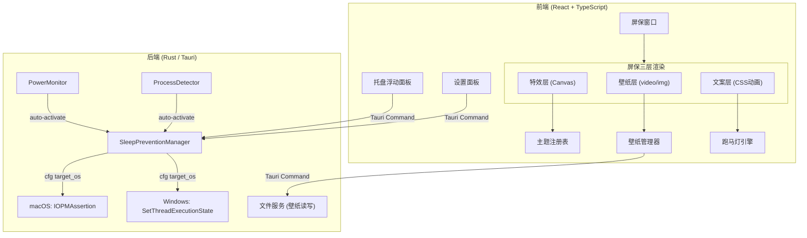

## 产品概述

AntiSleep 是一款跨平台防锁屏工具，专为 AI 开发无人值守场景设计。应用以系统托盘常驻形态运行，同时提供可展开的屏保可视化窗口——支持自定义壁纸（静态图/视频）、粒子特效叠加、跑马灯文案滚动，营造沉浸式桌面氛围。支持 macOS 和 Windows 双平台。

## 核心功能

- **防锁屏引擎**：跨平台阻止系统自动锁屏/休眠，macOS 使用 IOKit API，Windows 使用 Win32 API，支持防屏幕休眠与防系统休眠两种模式
- **壁纸系统**：支持静态图片（JPG/PNG/WebP）和视频（MP4/WebM）作为屏保背景，内置精选壁纸，用户可拖拽上传本地文件，视频壁纸自动静音循环播放
- **跑马灯文案**：自定义多行文案轮播滚动展示，支持字体大小/颜色/速度调节，多种滚动模式（水平滚动、垂直滚动、淡入淡出），可用于展示 AI 任务进度、激励语录、待办提醒等
- **分层渲染**：底层壁纸/视频 → 中层粒子特效主题（半透明叠加） → 顶层跑马灯文案+时间状态信息，每层可独立开关和调节透明度
- **多主题特效**：科技风（矩阵代码雨、粒子网络）、自然风（星空、极光）、简约风（呼吸灯、时钟）可切换主题叠加在壁纸上
- **系统托盘控制**：常驻托盘图标，一键启停防锁屏，显示状态与倒计时
- **个性化设置**：自定义时长、自动启停规则、主题偏好、透明度等参数
- **智能场景**：检测充电状态/特定进程运行时自动激活防锁屏

## Tech Stack

- **框架**：Tauri 2.0（Rust 后端 + Web 前端），参考 mark-magic 项目配置模式
- **前端**：React + TypeScript + Tailwind CSS + Vite
- **后端**：Rust（Tauri 核心）
- **屏保渲染**：HTML Canvas / WebGL + HTML5 Video
- **数据持久化**：Tauri Store 插件（JSON 文件）
- **构建工具**：Vite 5 + pnpm

## Implementation Approach

采用 Tauri 2.0 跨平台方案，Rust 后端通过条件编译实现 macOS（IOKit IOPMAssertionCreateWithName）和 Windows（SetThreadExecutionState）的防锁屏机制。前端采用三层叠加渲染架构：底层 `<video>` / `` 承载壁纸，中层 Canvas 绘制粒子特效，顶层 CSS 动画驱动跑马灯文案。系统托盘使用 Tauri 2.0 内置 Tray API，点击弹出浮动面板窗口。

### 跨平台防锁屏机制

通过 Rust 条件编译（`#[cfg]`）实现平台适配：

- **macOS**：通过 `core-foundation` crate 调用 IOKit 的 `IOPMAssertionCreateWithName`，创建电源断言阻止休眠
- **Windows**：通过 `windows-sys` crate 调用 Win32 API `SetThreadExecutionState`，设置 `ES_CONTINUOUS | ES_SYSTEM_REQUIRED | ES_DISPLAY_REQUIRED`
- 两个平台均通过 Tauri Command 暴露统一的 `start_prevention` / `stop_prevention` 接口

### 分层渲染架构

屏保窗口采用三层叠加方案，每层独立渲染、可独立控制：

1. **壁纸层**：`<video>` 元素（视频壁纸）或 `` 元素（静态壁纸），全屏 cover 填充，视频自动循环静音播放
2. **特效层**：透明背景的 `<canvas>`，叠加在壁纸之上，绘制粒子/图形动画，通过 `globalAlpha` 控制透明度
3. **文案层**：CSS 动画驱动的跑马灯，叠加在最上层，支持水平滚动/垂直滚动/淡入淡出三种模式

### 跑马灯系统

- 每条文案独立配置内容、字体大小、颜色
- 滚动模式：水平无限循环滚动、垂直逐行翻滚、淡入淡出切换
- CSS `@keyframes` 驱动动画，`animation-duration` 由用户设定速度映射
- 支持多行文案队列，按间隔时间轮播

### 系统托盘架构

使用 Tauri 2.0 内置 Tray 功能，托盘点击弹出浮动面板窗口（非原生菜单，而是自定义 UI 窗口），实现更精美的交互体验。

### 参考项目

工作区内 `mark-magic` 项目使用相同 Tauri 2.0 技术栈（tauri 2、@tauri-apps/api ^2.10.1、@tauri-apps/cli ^2.10.1、Vite + React + TypeScript），其 Cargo.toml 依赖配置、tauri.conf.json 结构、main.rs 命令注册模式可直接复用。

## Architecture Design



## Directory Structure

```
/Users/yorke/Desktop/cloud5/AntiSleep/
├── docs/
│   └── PRODUCT_DESIGN.md              # [NEW] 产品设计文档（完整产品规划、功能规格、交互设计、技术方案）
├── src/                                # 前端源码
│   ├── main.tsx                        # [NEW] React 入口
│   ├── App.tsx                         # [NEW] 应用根组件，路由与窗口管理
│   ├── styles/
│   │   └── globals.css                 # [NEW] Tailwind 全局样式 + 跑马灯关键帧动画
│   ├── components/
│   │   ├── tray/
│   │   │   ├── TrayPanel.tsx           # [NEW] 托盘浮动面板主组件
│   │   │   ├── StatusIndicator.tsx     # [NEW] 状态呼吸灯指示器
│   │   │   ├── DurationSelector.tsx    # [NEW] 时长选择胶囊组
│   │   │   └── ThemePreviewGrid.tsx    # [NEW] 主题缩略图网格
│   │   ├── screensaver/
│   │   │   ├── ScreensaverWindow.tsx   # [NEW] 屏保全屏窗口容器（三层叠加）
│   │   │   ├── WallpaperLayer.tsx      # [NEW] 壁纸渲染层（视频/图片）
│   │   │   ├── EffectLayer.tsx         # [NEW] 粒子特效 Canvas 层
│   │   │   ├── MarqueeLayer.tsx        # [NEW] 跑马灯文案层
│   │   │   ├── FloatingControls.tsx    # [NEW] 屏保悬浮控制条
│   │   │   └── InfoOverlay.tsx         # [NEW] 左上角时间/状态信息叠加
│   │   └── settings/
│   │       ├── SettingsPanel.tsx        # [NEW] 设置面板主组件（标签页式）
│   │       ├── GeneralSettings.tsx     # [NEW] 通用设置标签
│   │       ├── WallpaperSettings.tsx   # [NEW] 壁纸管理标签
│   │       ├── MarqueeSettings.tsx     # [NEW] 跑马灯文案编辑标签
│   │       ├── ThemeSettings.tsx       # [NEW] 主题偏好标签
│   │       └── SmartSceneSettings.tsx  # [NEW] 智能场景标签
│   ├── themes/
│   │   ├── types.ts                    # [NEW] ThemeRenderer 接口定义
│   │   ├── registry.ts                 # [NEW] 主题注册表
│   │   ├── matrix.ts                   # [NEW] 科技风-矩阵代码雨
│   │   ├── particle-network.ts         # [NEW] 科技风-粒子网络
│   │   ├── starfield.ts                # [NEW] 自然风-星空
│   │   ├── aurora.ts                   # [NEW] 自然风-极光
│   │   ├── breathing-light.ts          # [NEW] 简约风-呼吸灯
│   │   └── clock.ts                    # [NEW] 简约风-时钟
│   ├── marquee/
│   │   ├── types.ts                    # [NEW] 跑马灯类型定义（MarqueeItem, MarqueeMode）
│   │   ├── engine.ts                   # [NEW] 跑马灯引擎（文案队列管理、轮播调度）
│   │   └── animations.ts              # [NEW] CSS 动画配置（速度映射、模式切换）
│   ├── wallpaper/
│   │   ├── types.ts                    # [NEW] 壁纸类型定义（WallpaperType, WallpaperSource）
│   │   └── manager.ts                  # [NEW] 壁纸管理器（加载/切换/预加载）
│   ├── hooks/
│   │   ├── useSleepPrevention.ts       # [NEW] 防锁屏状态管理 Hook
│   │   ├── useSettings.ts             # [NEW] 设置状态管理 Hook（zustand store）
│   │   └── useScreensaver.ts          # [NEW] 屏保窗口控制 Hook
│   ├── stores/
│   │   └── appStore.ts                # [NEW] Zustand 全局状态 store
│   └── lib/
│       └── tauri-commands.ts           # [NEW] Tauri Command 封装
├── src-tauri/                          # Rust 后端源码
│   ├── Cargo.toml                      # [NEW] Rust 依赖配置（参考 mark-magic 版本）
│   ├── build.rs                        # [NEW] Tauri 构建脚本
│   ├── tauri.conf.json                 # [NEW] Tauri 应用配置（参考 mark-magic 结构）
│   ├── capabilities/
│   │   └── default.json               # [NEW] Tauri 2.0 权限声明
│   ├── icons/                          # [NEW] 应用图标
│   └── src/
│       ├── main.rs                     # [NEW] Tauri 入口，注册插件/命令/托盘
│       ├── commands.rs                 # [NEW] Tauri Command 定义（start/stop/list_processes）
│       ├── sleep_prevention.rs         # [NEW] 防锁屏核心逻辑（跨平台分发）
│       ├── platform/
│       │   ├── mod.rs                  # [NEW] 平台模块入口
│       │   ├── macos.rs                # [NEW] macOS IOKit 实现
│       │   └── windows.rs              # [NEW] Windows SetThreadExecutionState 实现
│       ├── power_monitor.rs            # [NEW] 电源状态监听
│       └── tray.rs                     # [NEW] 托盘菜单构建与事件处理
├── assets/
│   ├── wallpapers/                     # [NEW] 内置壁纸资源（3-5 张精选）
│   └── icons/                          # [NEW] 托盘图标资源
├── index.html                          # [NEW] HTML 入口
├── package.json                        # [NEW] Node.js 依赖配置
├── tsconfig.json                       # [NEW] TypeScript 配置
├── vite.config.ts                      # [NEW] Vite 构建配置（参考 mark-magic）
├── tailwind.config.js                  # [NEW] Tailwind 配置
├── postcss.config.js                   # [NEW] PostCSS 配置
└── README.md                           # [NEW] 项目说明
```

## Implementation Notes

- Tauri 2.0 Tray 需要在 `tauri.conf.json` 中声明权限，在 `capabilities/default.json` 中配置 `tray:allow-new` 等
- macOS IOKit 调用需 `core-foundation` crate；Windows 需 `windows-sys` crate，条件编译 `#[cfg(target_os = "...")]` 切换
- 防锁屏断言生命周期必须严格管理，应用退出时必须释放——利用 Tauri 的 `on_window_event` 监听 CloseRequested 做清理
- 视频壁纸使用 `<video>` 元素 `autoplay loop muted playsinline`，当屏保窗口不可见时应暂停视频和 Canvas 渲染以节省 CPU/GPU
- Canvas 动画用 `requestAnimationFrame` 驱动，窗口隐藏时取消动画帧
- 壁纸文件通过 `tauri-plugin-fs` 或 Tauri asset protocol 加载，视频文件需考虑大文件性能，预加载下一张
- 跑马灯 CSS 动画在 `globals.css` 中定义 `@keyframes`，通过 inline style 的 `animation-duration` 动态控制速度
- 参考 mark-magic 的 Cargo.toml（tauri 2、serde 1、tauri-plugin-fs 2）、tauri.conf.json 结构和 main.rs 命令注册模式
- Rust 端 `#![cfg_attr(not(debug_assertions), windows_subsystem = "windows")]` 防止 Windows 发布版弹出控制台窗口

## 设计风格

采用暗色沉浸式设计语言，融合毛玻璃质感（backdrop-blur）、微光动效与层叠视觉。整体风格兼具科技感与优雅感，与系统深色模式无缝融合。屏保窗口以壁纸为底，粒子特效半透明叠加，跑马灯文案以发光文字形式流动，营造沉浸式桌面氛围。

## 页面规划

### 1. 托盘浮动面板（点击托盘图标弹出）

精致紧凑的毛玻璃浮动面板，采用左右分栏布局：

- **左侧栏（状态+操作）**：
- 顶部：圆形呼吸灯状态指示器，脉冲动画（绿色=激活/灰色=暂停/橙色=即将到期）
- 中部：大型圆角启停按钮，带涟漪点击效果
- 底部：时长选择胶囊组（30m / 1h / 2h / 无限），选中态带渐变高亮
- **右侧栏（预览+快捷）**：
- 2行3列主题缩略图网格，悬浮时微缩放+发光边框
- 底部：三个图标按钮（设置齿轮、屏保全屏、退出），悬浮时 tooltip
- **底部**：当前跑马灯文案预览条，可快速编辑

### 2. 屏保全屏窗口（三层叠加沉浸体验）

- **壁纸层**：全屏 cover 填充的静态图或循环视频，自动静音播放
- **特效层**：半透明 Canvas 粒子动画叠加在壁纸上，营造氛围感
- **文案层**：
- 跑马灯区域：屏幕中下部，发光文字水平滚动/垂直翻滚/淡入淡出
- 信息叠加：左上角半透明显示当前时间 + 防锁屏剩余时长 + 状态图标
- **悬浮控件**：鼠标移动时底部中央浮现优雅控制栏
- 毛玻璃背景条，圆角胶囊形态
- 左：进度环（剩余时长） | 中：主题/壁纸/文案快捷切换图标 | 右：透明度滑块 + 关闭按钮
- 3秒无操作平滑淡出

### 3. 设置面板（独立窗口，标签页式布局）

暗色毛玻璃背景，左侧竖向标签导航，右侧内容区：

- **通用**：开机自启开关、默认防锁屏模式（屏幕/系统）、默认时长滑块、全局快捷键设置
- **壁纸**：壁纸库网格展示（内置+自定义），拖拽上传区，当前壁纸预览，视频壁纸开关
- **文案**：文案列表编辑器（增删改排序），每条支持内容+字体+颜色+速度，滚动模式切换，实时预览区
- **主题**：默认主题选择、特效层开关、动画速度滑块、粒子密度滑块、特效透明度、颜色自定义取色器
- **智能场景**：充电时自动激活开关、指定进程名输入框、定时计划
- **关于**：版本信息、使用说明、快捷键列表

## Agent Extensions

### SubAgent

- **code-explorer**
- Purpose: 深入探索 mark-magic 项目的 Tauri 2.0 配置细节（tray 配置、窗口管理、Command 注册、capabilities 权限声明），作为 AntiSleep 项目实现的精确参考
- Expected outcome: 确认 Tauri 2.0 tray 配置方式、多窗口管理、前端 @tauri-apps/api 调用模式等最佳实践